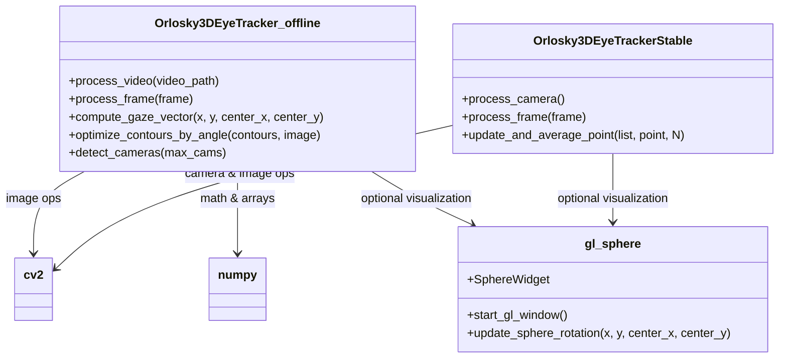
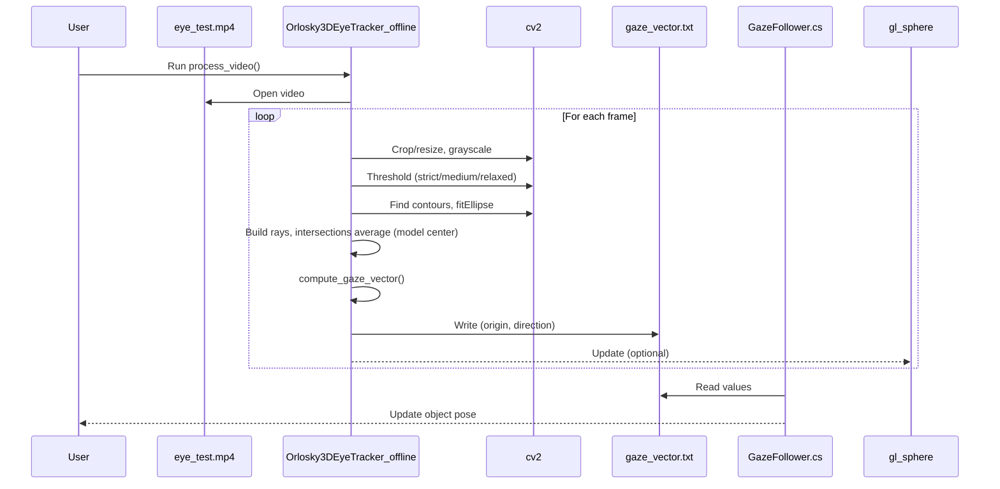

# EyeTracker 项目说明（中文）

## 概述
- 本项目提供近眼红外摄像头的瞳孔检测与 3D 视线估计。核心模块包含：
  - `OrloskyPupilDetector.py`：2D 瞳孔椭圆拟合（视频/摄像头）
  - `3DTracker/Orlosky3DEyeTracker.py`：3D 版本（原版）
  - `3DTracker/Orlosky3DEyeTrackerStable.py`：3D 稳定版（加入时序平滑与跳变限幅）
  - `3DTracker/Orlosky3DEyeTracker_offline.py`：离线处理（默认读取 `eye_test.mp4`）
  - `FrontCameraTracker/Orlosky3DEyeTrackerFrontCamera.py`：前置相机版本（可选两个 USB 摄像头）
  - `3DTracker/gl_sphere.py`：OpenGL 可视化（可选）

## 运行环境
- 操作系统：macOS（兼容 Windows / Linux）
- Python 虚拟环境：项目根目录下 `.venv`
- 依赖：
  - 必需：`opencv-python`、`numpy`（避免 `2.0.0` 版本）
  - 可选（OpenGL 可视化）：`PyQt5`、`PyOpenGL`

## 快速开始
- 激活虚拟环境：
  - `source .venv/bin/activate`
- 运行测试视频（2D）：
  - `python OrloskyPupilDetector.py`
- 运行测试视频（3D 离线）：
  - `python 3DTracker/Orlosky3DEyeTracker_offline.py`
- 运行 3D 稳定版（推荐）：
  - `python 3DTracker/Orlosky3DEyeTrackerStable.py`

## 摄像头模式
- 2D 检测切换到摄像头：
  - `python OrloskyPupilDetector.py --source camera --camera-index 0`
- 前置相机双设备（GUI 选择两个 USB 摄像头）：
  - `python FrontCameraTracker/Orlosky3DEyeTrackerFrontCamera.py`
  - 在 GUI 中分别选择“眼相机”和“外部相机”，按 `c` 校准红点到外部视图中心
- 3D 原版/稳定版摄像头（GUI 选择）：
  - `python 3DTracker/Orlosky3DEyeTracker.py`
  - `python 3DTracker/Orlosky3DEyeTrackerStable.py`

## 平台适配
- macOS 使用 `cv2.CAP_AVFOUNDATION` 打开摄像头；Windows 使用 `cv2.CAP_DSHOW`；Linux 使用 `cv2.CAP_V4L2`
- 默认设置分辨率 `640x480`、帧率 `30fps`

## 输出
- `gaze_vector.txt`：持续写入视线原点与方向（逗号分隔 6 个数值），可被 Unity 的 `3DTracker/GazeFollower.cs` 读取用于场景对象跟随

## 操作与快捷键
- 通用：`q` 退出，`space` 暂停/继续
- 前置相机（外部视图红点）：`c` 校准红点到外部视图中心
- 稳定版 3D：窗口左键点击可锁定 2D 眼球中心

## 常见问题
- 摄像头无法打开：尝试更换索引 `--camera-index` 或在 GUI 选择不同编号；在 mac 上设备编号与插拔顺序有关
- 画面漂移：使用 `3DTracker/Orlosky3DEyeTrackerStable.py`（启用时序平滑 + 跳变限幅）
- `numpy 2.0.0` 兼容性问题：请安装 `numpy!=2.0.0`（例如 `2.2.x`）
- `eye_test.mp4`：默认位于项目根目录；离线 3D 版本会自动读取该文件，无则弹出选择窗口

## 文件说明
- `OrloskyPupilDetector.py`：2D 瞳孔检测与椭圆拟合，支持视频/摄像头、命令行参数切换
- `3DTracker/Orlosky3DEyeTracker.py`：原版 3D 视线估计
- `3DTracker/Orlosky3DEyeTrackerStable.py`：增加形态学清理、EMA 平滑与最大跳变像素限制，稳定输出
- `3DTracker/Orlosky3DEyeTracker_offline.py`：离线处理 `eye_test.mp4`，逐帧输出 3D 视线
- `FrontCameraTracker/Orlosky3DEyeTrackerFrontCamera.py`：双摄像头版本，眼相机用于拟合，外部相机展示红点凝视位置
- `3DTracker/gl_sphere.py`：OpenGL 线框球与绿圈可视化，需要 `PyQt5` 与 `PyOpenGL`

## 类图（Mermaid）

## 时序图（Mermaid）

## 处理流程（Mermaid Flowchart）

## 宏观逻辑说明
- 角色与关系：
  - `Orlosky3DEyeTracker.py` 负责从摄像头/视频读取图像、进行瞳孔椭圆拟合与模型中心估计，并计算 3D 视线向量；可选调用 `gl_sphere.py` 做 OpenGL 可视化叠加。
  - `gl_sphere.py` 提供线框球和绿色环的 OpenGL 渲染，将来自 2D 追踪的瞳孔中心与球心映射到 3D，并可返回图像用于与原始帧融合。
- 数据流与调用：
  - 采集帧 → 预处理/阈值 → 轮廓与椭圆拟合 → 构建多条法向“射线” → 两两求交并平均得到眼球 2D 模型中心 → 将 `(pupil_x, pupil_y, center_x, center_y)` 输入到 3D 几何计算得到 `(sphere_center, gaze_direction)`（`3DTracker/Orlosky3DEyeTracker.py:623`）。
  - 若启用可视化，则将 `(pupil_x, pupil_y, center_x, center_y)` 传给 `update_sphere_rotation` 渲染结果（`3DTracker/gl_sphere.py:237`）。
- 阶段划分：
  - 输入阶段：摄像头/视频打开与帧采集（`3DTracker/Orlosky3DEyeTracker.py:807`, `3DTracker/Orlosky3DEyeTracker.py:844`）
  - 视觉检测：暗区寻址、三档阈值、轮廓筛选、椭圆拟合与优选（`3DTracker/Orlosky3DEyeTracker.py:783`, `3DTracker/Orlosky3DEyeTracker.py:790`, `3DTracker/Orlosky3DEyeTracker.py:306`）
  - 稳定化：射线集维护、交点平均与滑动平均得到模型中心（`3DTracker/Orlosky3DEyeTracker.py:356`, `3DTracker/Orlosky3DEyeTracker.py:447`）
  - 3D估计：屏幕坐标到世界坐标的投影、射线-球体求交、轴角旋转得到视线向量（`3DTracker/Orlosky3DEyeTracker.py:647`, `3DTracker/Orlosky3DEyeTracker.py:674`, `3DTracker/Orlosky3DEyeTracker.py:742`）
  - 渲染与输出：OpenGL 叠加、文本输出、`gaze_vector.txt` 写入（`3DTracker/Orlosky3DEyeTracker.py:441`, `3DTracker/Orlosky3DEyeTracker.py:753`）

## Orlosky3DEyeTracker.py 详细说明
- 文件结构（主要方法）
  - `detect_cameras(max_cams)`：枚举可用摄像头（`3DTracker/Orlosky3DEyeTracker.py:25`）
  - `crop_to_aspect_ratio(image)`：裁剪并重采样到 `640x480`（`3DTracker/Orlosky3DEyeTracker.py:42`）
  - `get_darkest_area(image)`：稀疏扫描找到最暗区域作为瞳孔种子（`3DTracker/Orlosky3DEyeTracker.py:67`）
  - `apply_binary_threshold(image, base, delta)`：反向二值化（`3DTracker/Orlosky3DEyeTracker.py:61`）
  - `optimize_contours_by_angle(contours, image)`：角度一致性筛点（`3DTracker/Orlosky3DEyeTracker.py:109`）
  - `filter_contours_by_area_and_return_largest(contours, pixel_thresh, ratio_thresh)`：面积与纵横比过滤（`3DTracker/Orlosky3DEyeTracker.py:160`）
  - `check_contour_pixels(...)`、`check_ellipse_goodness(...)`：椭圆拟合质量评分（`3DTracker/Orlosky3DEyeTracker.py:195`, `3DTracker/Orlosky3DEyeTracker.py:231`）
  - `process_frames(...)`：三档阈值候选、拟合与最佳选择；维护射线列表（`3DTracker/Orlosky3DEyeTracker.py:270`）
  - `compute_average_intersection(frame, ray_lines, N, M, spacing)`：选取射线对计算交点并滑动平均（`3DTracker/Orlosky3DEyeTracker.py:506`）
  - `update_and_average_point(point_list, new_point, N)`：模型中心时间窗平均（`3DTracker/Orlosky3DEyeTracker.py:447`）
  - `compute_gaze_vector(x, y, center_x, center_y)`：屏幕坐标到 3D 视线（`3DTracker/Orlosky3DEyeTracker.py:623`）
  - `process_frame(frame)`：单帧处理入口（`3DTracker/Orlosky3DEyeTracker.py:777`）
  - `process_camera()`、`process_video()`、`selection_gui()`：输入源选择、采集与 GUI（`3DTracker/Orlosky3DEyeTracker.py:807`, `3DTracker/Orlosky3DEyeTracker.py:844`, `3DTracker/Orlosky3DEyeTracker.py:874`）
- 核心算法
  - 图像处理：三档反向阈值化 + 形态学膨胀，选择“最优”椭圆依据为覆盖率 × 厚边像素数平方 × 细边比例（`3DTracker/Orlosky3DEyeTracker.py:328`）。
  - 射线构建：以拟合椭圆的次轴方向作为局部法向，形成多帧射线集合用于稳健估计（`3DTracker/Orlosky3DEyeTracker.py:474`）。
  - 模型中心：从射线集合中采样并两两求交，过滤过近角度，取滑动平均得到眼球 2D 中心（`3DTracker/Orlosky3DEyeTracker.py:545`，`3DTracker/Orlosky3DEyeTracker.py:570`）。
  - 坐标转换：将屏幕坐标映射到远平面，构造相机到远点的射线；将 2D 模型中心映射到世界坐标内的球心偏移（`3DTracker/Orlosky3DEyeTracker.py:652`, `3DTracker/Orlosky3DEyeTracker.py:667`）。
  - 空间定位：求射线与内球的交点；若判别式 < 0 使用切点近似；以轴角法将局部 +Z 旋转到目标方向，得到 `gaze_direction`（`3DTracker/Orlosky3DEyeTracker.py:678`, `3DTracker/Orlosky3DEyeTracker.py:740`）。
- 关键方法（输入/输出）
  - `compute_gaze_vector(x,y,center_x,center_y)`：输入屏幕坐标，输出 `sphere_center(3)` 与 `gaze_direction(3)`；同时写入 `gaze_vector.txt`（`3DTracker/Orlosky3DEyeTracker.py:753`）。
  - `compute_average_intersection(frame, ray_lines,N,M,spacing)`：输入帧与射线集合，输出交点平均 `(x,y)` 或 `None`（`3DTracker/Orlosky3DEyeTracker.py:506`）。
  - `optimize_contours_by_angle(contours,image)`：输入原始轮廓，输出筛选点集用于更稳健的椭圆拟合（`3DTracker/Orlosky3DEyeTracker.py:109`）。
- 异常处理
  - 摄像头/视频打开失败直接返回并打印错误（`3DTracker/Orlosky3DEyeTracker.py:822`, `3DTracker/Orlosky3DEyeTracker.py:852`）。
  - 判别式无交点时返回 `(None,None)` 或使用切点近似后再判断（`3DTracker/Orlosky3DEyeTracker.py:679`, `3DTracker/Orlosky3DEyeTracker.py:700`）。
  - 文件写入失败时打印异常并跳过（`3DTracker/Orlosky3DEyeTracker.py:769`）。

## gl_sphere.py 详细说明
- 文件结构（主要类与函数）
  - `SphereWidget`：QOpenGLWidget 渲染线框球、绿色环、射线与 2D 叠加（`3DTracker/gl_sphere.py:17`）。
  - `start_gl_window()`：创建 `QApplication/QMainWindow` 并显示窗口（`3DTracker/gl_sphere.py:221`）。
  - `update_sphere_rotation(x,y,center_x,center_y)`：将屏幕坐标映射到世界坐标，求射线与内球交点，构造旋转与视线向量并触发重绘（`3DTracker/gl_sphere.py:237`）。
- 核心算法
  - 3D 渲染：透视投影与视口映射；将球心从屏幕空间转换到 GL 世界坐标后偏移（`3DTracker/gl_sphere.py:124`）。
  - 交点与标记：与内球半径 `1/1.05` 的射线求交；在交点处绘制小白球标记（`3DTracker/gl_sphere.py:151`, `3DTracker/gl_sphere.py:177`）。
  - 旋转与视线：以局部 +Z 为绿圈方向，轴角法对齐到交点方向并得到视线单位向量（`3DTracker/gl_sphere.py:347`, `3DTracker/gl_sphere.py:381`）。
- 关键方法与渲染管线
  - `initializeGL/resizeGL/paintGL`：启用深度、设置投影、渲染线框、绿圈与 2D 叠加（`3DTracker/gl_sphere.py:103`, `3DTracker/gl_sphere.py:107`, `3DTracker/gl_sphere.py:114`）。
  - `draw_2d_circle(x,y)`：以正交投影绘制屏幕空间圆，作为 CV 叠加（`3DTracker/gl_sphere.py:35`）。
  - 交互：当前以更新方法驱动；可拓展键鼠事件以控制旋转或中心偏移。
- 性能优化
  - 线框与环使用线模式与预生成顶点索引；定时器维持 60FPS 事件循环（`3DTracker/gl_sphere.py:105`, `3DTracker/gl_sphere.py:231`）。
  - 合理减少 `gluSphere` 调用频率；必要时关闭交点标记以降低开销。

## 算法增强与分析
- 数学解释
  - 远平面投影：将屏幕坐标映射到归一化设备坐标，再按视场角与裁剪面尺度得到世界坐标远点（`fov_y=45°`，`far=100`）。
  - 射线-球求交：解二次方程 `a t^2 + b t + c = 0`，`a=|d|^2`，`b=2 d·L`，`c=|L|^2 - r^2`，取最小正根；`Δ<0` 时用切线近似。
  - 轴角旋转：轴 `u = z × target`，角 `θ = arccos(z·target)`，旋转矩阵按罗德里格公式构建。
- 参数选择与调优
  - 阈值三档 `Δ∈{5,15,25}` 覆盖不同光照；膨胀核 `5×5` 平滑边界；面积阈值 `>=1000`、纵横比 `<=3` 剔除非椭圆噪声。
  - 射线数量上限 `max_rays=100` 与交点滑动窗口 `M=1500` 平衡稳健与延迟；`N=5` 采样避免退化组合。
  - 球心屏幕映射系数 `×1.5` 与半径 `1/1.05` 依据视觉比例调整，可按设备与镜头参数标定。
- 复杂度分析
  - 单帧：阈值与膨胀 `O(W·H)`，轮廓提取近线性，椭圆拟合 `O(n)` 点，交点计算近 `O(N)`；总体近线性于像素数量。
  - 空间：帧级临时图像与轮廓存储为主，占用与分辨率线性关系。
- 替代方案
  - 瞳孔检测：霍夫圆/星形变换、深度学习分割（需标注与推理开销）。
  - 模型中心：RANSAC 拟合法向线并求交，相比平均更抗异常但开销更大。
  - 3D估计：直接用双目/多视角重建眼球参数，减少经验映射但需要更多传感器与标定。
